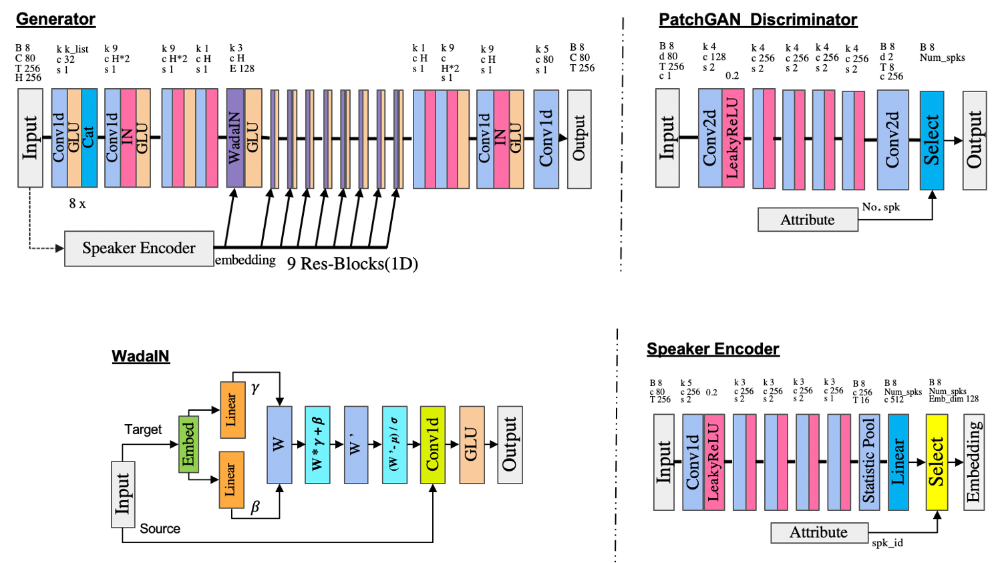

# WINVC: One-Shot Voice Conversion with Weight Adaptive Instance Normalization

-blue.svg)


Audio samples are available at [here](https://one-shot-voice-conversion-with-win.github.io).

<!--  -->


# Dependencies

- python 3.6.0
- pytorch 1.4.0
- pyyaml 5.4.1
- numpy 1.19.5
- librosa 0.8.0
- soundfile 0.10.2 
- tensorboardX 2.1


# Preprocess

### What you need to prepare first before running this project and how to prepare them

* We use the [ParallelWaveGAN](https://github.com/kan-bayashi/ParallelWaveGAN) as our vocoder, and [VCTK](https://datashare.ed.ac.uk/handle/10283/2651) as our data set.

* If you wanna run our project, please install as the description of ParallelWaveGAN project first.

* And then prepare all the mel-spectrogram data as ParallelWaveGAN do.

* Prepare the ```speaker_used.json``` file by yourself, as ```./data/80_train_speaker_used.json``` and ```./data/fine_tune_speaker_used.json``` show.

* Prepare the ```feats.scp``` file by runing ```./convert_decode/convert_mel/get_scp.py``` .


### Assume that your prepared mel-spectrograms are sorted in the files tree like:
```
├── p225
│   ├── p225_001-feats.npy
│   ├── p225_004-feats.npy
│   ├── p225_005-feats.npy
│   ......
├── p226
│   ├── p226_001-feats.npy
│   ├── p226_003-feats.npy
│   ├── p226_004-feats.npy
│   ......
├── p227
│   ......
├── p228
│   ......
│   ...
│   ...

```


# Training

Run the pretrain stage by ``` bash run_main.sh```. We use ***80*** speakers of VCTK data set, and all utterances for each person.


# Fine Tuning
To get the best performance, run the fine tune stage by ```bash run_fine_tune.sh```. We use the other ***10*** speakers of VCTK data set, and only ***1*** utterance for each person used.

# Inference
```
$ cd convert_decode/convert_mel
$ bash run_convert.sh
```

We generate one-shot voice conversion utterances  ***between the 10 one-shot speakers*** , and use their other unseen utterances to perform one-shot voice conversion!


